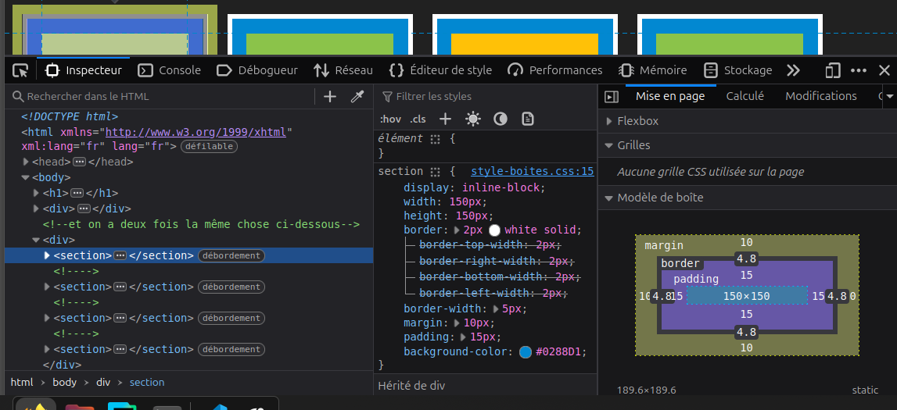

- Exercice9

1. Avec `height: 300px`, le paragraphe devient très grand alors que le texte reste en haut du bloc sans remplir tout l’espace.

Avec `height: 30px`, le paragraphe devient trop petit pour son texte, qui dépasse ou se fait couper tandis que le bloc reste visuellement limité à 30px.

2. l'image s'etire en hauteur 

Si on met `width` et `height` en même temps sur une image, elle peut se déformer. Pour garder ses proportions normales, il faut mettre une seule valeur et laisser l’autre en auto.

3. Avec `width:50%` l'image occupe la moitie de la largeur meme en reduisant la taille de la fenetre.

Avec `min-width : 200px; max-width : 450px;` empeche l'image d'etre trop petite et trop grande quand la taille fenetre change . 

- Exercice10:
7. `noir`:la couleur d'arrière-plan de la zone due à la propriété margin liée à la propriété padding qui est apparue entre la bordure et le contenu 

elle provient: `body {
  background-color: #212121;
}
`

8. 

ils correspondent: `width: 150px;
  height: 150px;`

