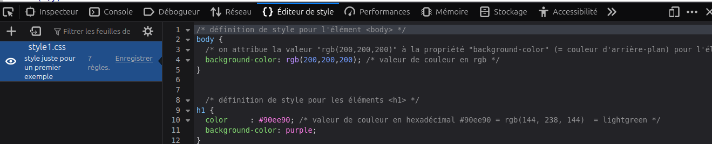
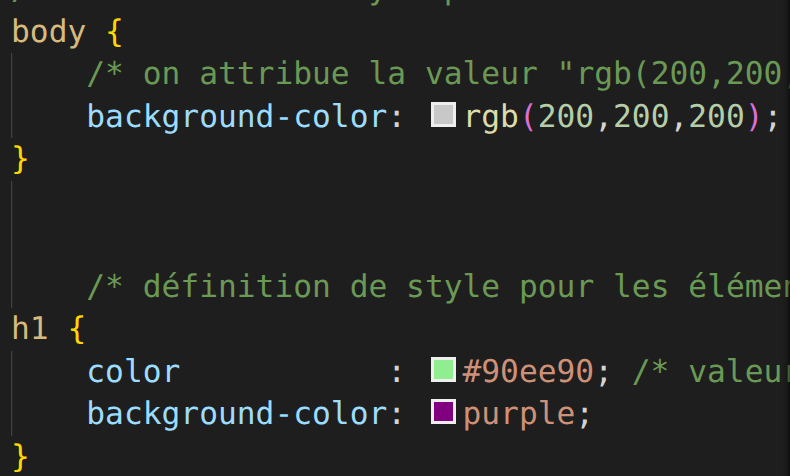
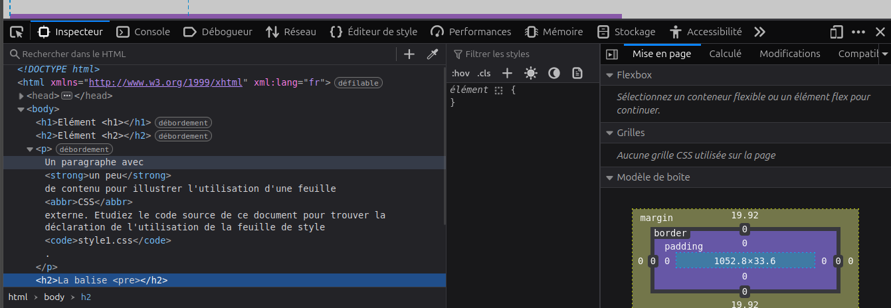
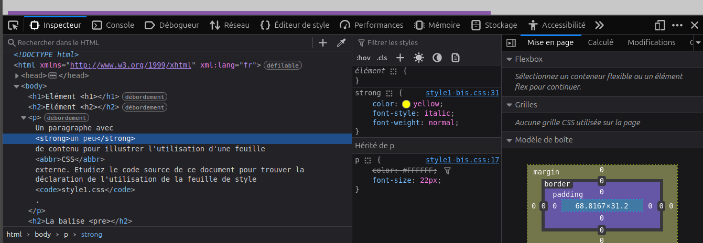
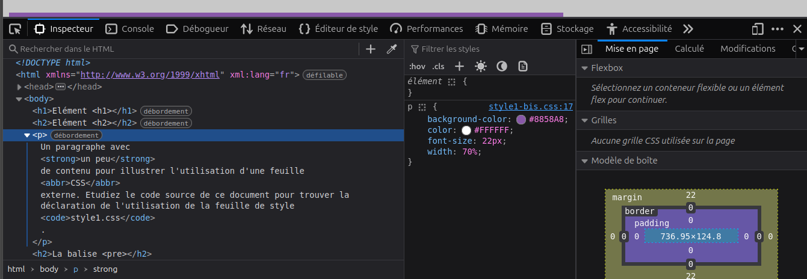
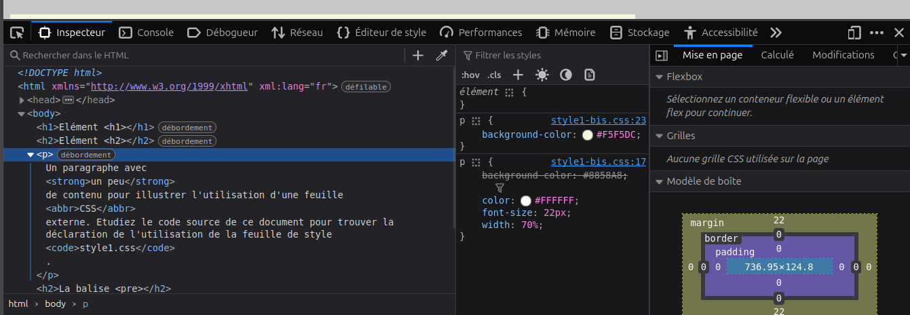
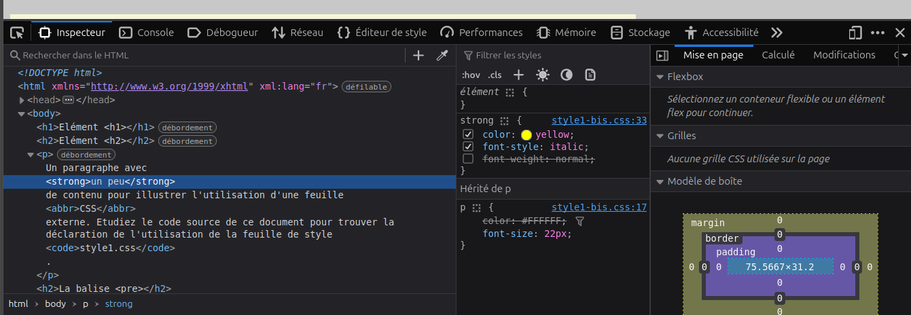
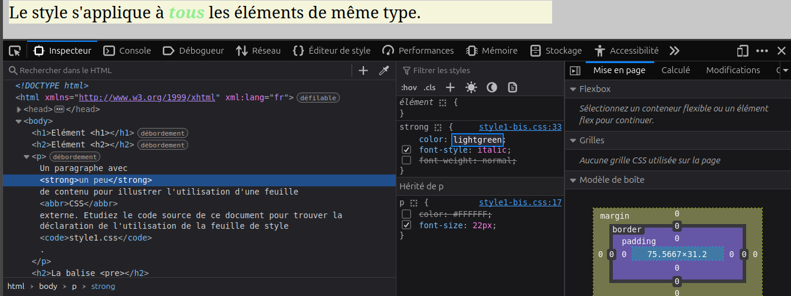

# Mes reponses 
- Exercice1:
2. la balise `pre` eprésente du texte préformaté qui est présenté exactement comme écrit dans le fichier HTML.
3. la mise en forme (couleur et autres disparaissent) lorsqu'on le commente
5. il est valide : `Félicitations ! Aucune erreur trouvée.`
- Exercice2:
1.
 

 2. l'oeil nous permet de voir l'effet de la feuille de style sur le fichier html
 3. 
 

 4. `color` a un effet purement sémantique sur la couleur du texte
 5. `background-color`: Définit la couleur de fond d’un élément.
 
 `color`: définit la couleur du texte d’un élément

 `font-size`:définit la taille du texte

 `width `: définit la largeur d’un élément.\
6. il est valide : `Félicitations ! Aucune erreur trouvée.`

- Exercice3:

3. Non, il n'etait pas valide, en passant par console ou par le validateur 

- Exercice4:
1. Pour `h2` la couleur noire par defaut pour le **texte**  et la blanche pour le **background**, 

Avec la feuille de style c'est la couleur voulu par l'auteur dans notre cas `h2` n'a aucune propriete CSS.

si aucune propriete css n'est defini alors `h2` est mis en gras, avec une grand taille de police

2.  Pour `p` 
la couleur du background  par defaut est le blanc, 

`Avec css`:  #8858A8

car c'est p-background qui est assigne a cette valeur.

`p {
	background-color: #8858A8;		}`

la couleur du texte : `color			: #FFFFFF;`
la taille du texte : 
	`font-size		: 22px;`

la largeur du paragraphe: 
	`width 			: 70%;`

3. Par defaut la couleur de texte pour l'élément <abbr> est : `noir`.

lorsque l'on utilise la feuille de style c'est: `#FFFFFF`

Parceque l'element `<abbr>` est dans `p` et tous element de ``p` a la couleur `#FFFFFF`.

`p{
	color			: #FFFFFF;
}`

4.   la couleur de texte définie pour l'élément 
 dans la feuille de style est:`#FFFFFF` et dans  `abbr` on a pas defini une couleur.

la valeur de la couleur définie pour l'élément `<strong>` dans la feuille de style est:`yellow`

la valeur de la couleur affichée est: `yellow` 

Parce que dans la feuille de style  on a precise la couleur que doit prendre `strong` .

Deduction : Si un élément n’a pas sa propre couleur, il prend celle de son parent. Mais si on lui donne une couleur à lui, alors il utilise la sienne et n’utilise plus celle du parent.
 
 5. 
   - `Avant p` Aucun changement,
   - `Apres p ` changement,
   - Deduction: la nouvelle propriete ecrase l'ancien.

6.   Si un élément n’a pas sa propre valeur, il prend celle du parent. Si on lui en donne une, il utilise la sienne. Une nouvelle valeur pour la même propriété écrase l’ancienne, une propriété différente s’ajoute.

- Exercice5:
1. l'intervalle de valeurs autorisées pour les éléments d'un triplet rgb est : 0 a 255.

 `pour h2{
	background-color: rgb(350,920,455);
 }` il a afficher :  `blanc`

2. Calculons la valeur hexadécimale de toutes les couleurs présentes dans le fichier `style1-bis.css`. 

on converit chaque  valeur en hexadecimal

rgb(200,200,200)

r=200 en en hexadecimal r=C8\
g=200 en en hexadecimal g=C8\
b=200 en en hexadecimal b=C8

3. Faisons de même pour les valeurs rgb des couleurs et testez à nouveau grâce à l'éditeur de style.

on convertit chaque valeur hexadecimal en entier en prenant deux a deux s'ils sont six et s'ils sont trois prendre un et  faire repeter deux fois pour former une paire.

`##90EE90`=rgb(144, 238, 144)\
`#8858A8`= rgb(136, 88, 168)\
`#FFFFFF`=rgb(255,255,255)\
`#F5F5DC`=rgb(245, 245, 220)\

- Exercice5: 

1. 

2. 

celui de p est barrer.

3. 

Les regles d'avant sont respectees

4.

il change dans l'affichage

Pour `p` la couleur change aussi,
5. 

De meme que `p` et `pre` change.\

6.  la valeur indiquée pour la propriété color est: rgb(255, 255, 0)

out en appuyant sur la touche Shift on a: tous les representation de la couleur,
