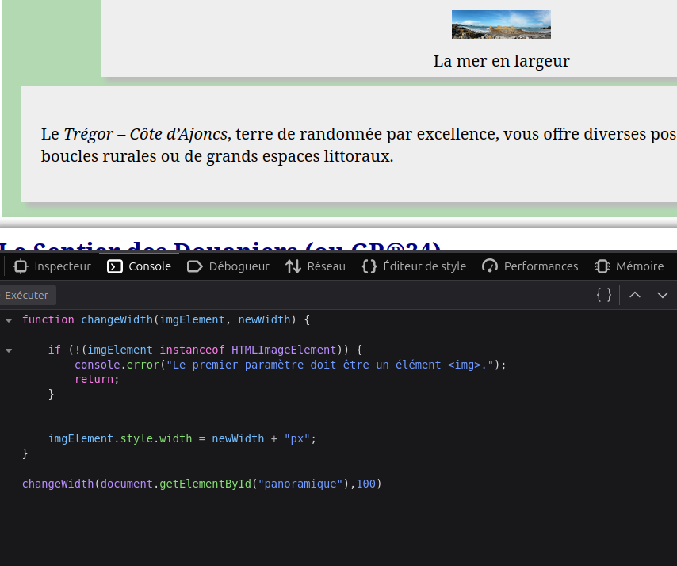

- Exercice1:\
1. ``

2. `Uncaught SyntaxError: redeclaration of non-configurable global property pano`\
3. 
1- `file:///home/lenoirgn/Documents/WorkHomeHtmlCss/fichiers-exercices-javascript2/images/panoramique.jpg"`\
2-  l'image a changer\
3- id 1ere image: `id="lamer"`\
`document.images[0].hasAttribute("alt") === false` verifie si img a un  attribut alt.\
4. 

```
var intro=document.getElementById("intro")
intro.textContent;
"
	La Côte d’Ajoncs se situe au coeur du pays du Trégor-Goëlo, entre l’île de Bréhat et la Côte de Granit Rose.
  "
  ```
 la difference: il n'a pas pris en compte de balises interne comme : `em` et `a`\

la difference 
 ```
 intro.textContent = "Une rapide présentation de la côte d'ajoncs.";
"Une rapide présentation de la côte d'ajoncs." 

intro.textContent = "Une rapide présentation de la <strong>côte d'ajoncs</strong>.";
"Une rapide présentation de la <strong>côte d'ajoncs</strong>." 
```

conclusion: 
```
La propriété textContent permet d’accéder ou de modifier uniquement le texte brut d’un élément HTML.
Elle renvoie exactement le texte contenu dans l’élément, sans tenir compte des balises HTML, et lorsque l’on affecte une valeur à textContent, le navigateur affiche cette valeur telle quelle, même si elle contient des balises comme <strong>.
```

6. 

```
function changeWidth(imgElement, newWidth) {
    if (!(imgElement instanceof HTMLImageElement)) {
        console.error("Le premier paramètre doit être un élément .");
        return;
    }
    imgElement.style.width = newWidth + "px";
}
changeWidth(document.getElementById("panoramique"),200)

```



- Exercice2:\

1. 
```
function changePano() {
    const pano = document.getElementById("panoramique");
    if (!pano) {
        console.error("Aucun élément avec id 'panoramique' trouvé.");
        return;
    }
    pano.src = "images/panoramique2.jpg";
}
changePano()
```

3. 
```
function changePano() {
    // On récupère l'élément  ayant id="panoramique"
    const pano = document.getElementById("panoramique");

    
    if (!pano) {
        console.error("Aucun élément avec id 'panoramique' trouvé.");
        return;
    }

    // On change la source de l'image
    pano.src = "images/panoramique2.jpg";
}
function changePano2() {
    // On récupère l'élément  ayant id="panoramique"
    const pano = document.getElementById("panoramique");

    
    if (!pano) {
        console.error("Aucun élément avec id 'panoramique' trouvé.");
        return;
    }

    // On change la source de l'image
    pano.src = "images/panoramique.jpg";
}

// on récupère l'élément d'id "panoramique"
const pano = document.getElementById("panoramique");
// on crée l'abonnement sur cet élément de la fonction "changePano" pour l'événement "mouseover"
pano.addEventListener("mouseover",changePano);
pano.addEventListener("mouseout",changePano2);
```

- Exercice4:\
`celsius, fahrenheit,` ce sont des `input`

`cToF et fToC` ce sont des `bouton`


